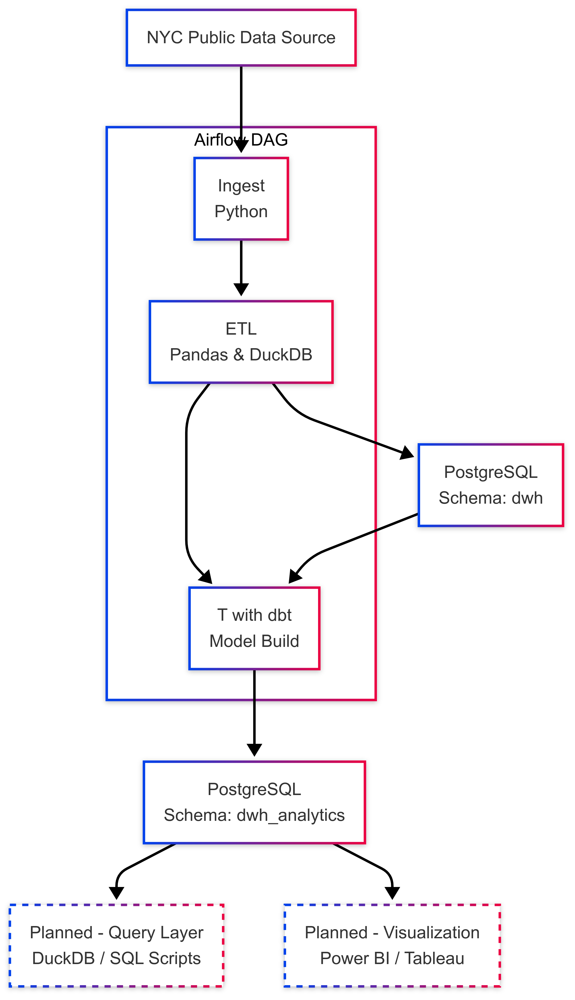

# NYC Yellow Taxi Trip – Lean Data Engineering Project

This is a learn E(T)LT pipeline project for learning core Data Engineering concepts. It extracts and transforms NYC Yellow Taxi trip data using Python, Apache Airflow, and dbt, all containerized with Docker.

## 🔧 Tech Stack

- **Python**: Extract and load trip data from NYC TLC to PostgreSQL
- **Apache Airflow**: Schedule and orchestrate the pipeline
- **dbt**: Transform raw data into clean models for analysis
- **PostgreSQL**: Data storage
- **Docker**: Local containerized environment

## 📌 Pipeline Overview

1. **Extract + Load (EL)**:  
   A Python script to load Yellow Taxi trip data get from the [NYC TLC portal](https://www.nyc.gov/site/tlc/about/tlc-trip-record-data.page) into a raw table in PostgreSQL with clean data before.

2. **Transform (T)**:  
   dbt runs SQL models on top of raw tables to clean, rename, filter, and summarize the data.

3. **Schedule**:  
   Airflow orchestrates the EL and T steps as DAGs.

### 🔄 Pipeline Architecture (Mermaid Diagram)

---

💡 This project was made possible with guidance and suggestions from ChatGPT, as part of my self-learning journey in Data Engineering.
